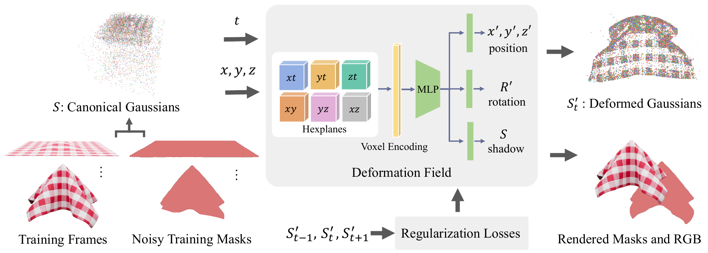

# MD-Splatting: Learning Metric Deformation from 4D Gaussians in Highly Deformable Scenes

## arXiv Preprint

### [Project Page](https://deformgs.github.io)| [Paper](https://deformgs.github.io/paper.pdf)

---------------------------------------------------

---

   


## Installation 

**Pull the code**

```
git clone --recursive https://github.com/momentum-robotics-lab/deformgs.git
```

**Docker**

We use docker to run the code, you will need to install docker and [nvidia-docker](https://docs.nvidia.com/datacenter/cloud-native/container-toolkit/latest/install-guide.html). You can build the docker image by running the following command:
```
docker build -f deformgs.dockerfile -t deformgs .
```

If you don't want to build the docker image, you can pull a pre-built image from docker hub:
```
docker pull bartduis/deformgs:latest
```

Now create a container from the image and run it.
``` 
docker run -it --gpus all --network=host --shm-size=50G  --name deformgs -v /home/username:/workspace deformgs
cd /workspace 
pip install -e submodules/depth-diff-gaussian-rasterization
pip install -e submodules/simple-knn
```
At this point your container is ready to run the code.

**Conda**

```
conda create -n deformgs python=3.7 
conda activate deformgs

pip install -r requirements.txt
pip install -e submodules/depth-diff-gaussian-rasterization
pip install -e submodules/simple-knn
```

Please let us know if you experience any issues with installing the code, using docker should be most reliable.

## Data from the Paper

We make the data used in the paper available [here](https://cmu.box.com/s/hb2dx2ax8q3ovcwg5kfans3xd5w7d2vq).
Place the downloaded folders in the `deformgs/data/` folder to arrive at a folder structure like this:
```
├── data
│   | robo360 
│     ├── duvet
│     ├── cloth 
│   | synthetic 
│     ├── scene_1
│     ├── ...
│     ├── scene_6

```


## Training
To train models for all scenes from the paper, run the following scripts.
``` 
./run_scripts/run_all_synthetic.sh
./run_scripts/run_all_robo360.sh
``` 

## Rendering
Run the following script to render images for all scenes. 

```
./run_scripts/render_all_synthetic.sh
./run_scripts/render_all_robo360.sh
```


## How to prepare your dataset?


---
## Contributions

---
Some source code of ours is borrowed from [3DGS](https://github.com/graphdeco-inria/gaussian-splatting), [k-planes](https://github.com/Giodiro/kplanes_nerfstudio),[HexPlane](https://github.com/Caoang327/HexPlane), [TiNeuVox](https://github.com/hustvl/TiNeuVox), [4DGS](https://github.com/hustvl/4DGaussians). We appreciate the excellent works of these authors.


## Citation
```
@misc{duisterhof2023mdsplatting,
      title={MD-Splatting: Learning Metric Deformation from 4D Gaussians in Highly Deformable Scenes}, 
      author={Bardienus P. Duisterhof and Zhao Mandi and Yunchao Yao and Jia-Wei Liu and Mike Zheng Shou and Shuran Song and Jeffrey Ichnowski},
      year={2023},
      eprint={2312.00583},
      archivePrefix={arXiv},
      primaryClass={cs.CV}
}
```
